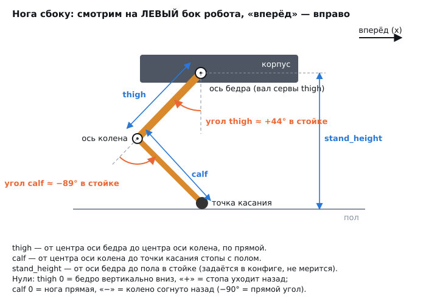
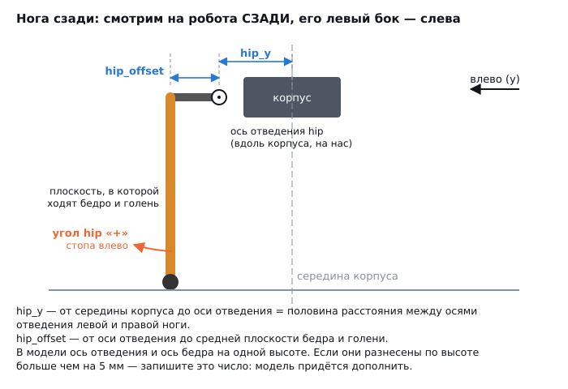
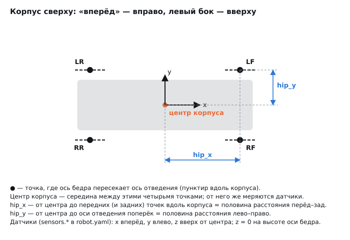
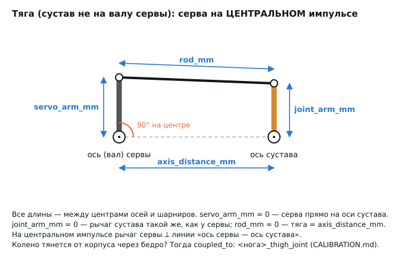
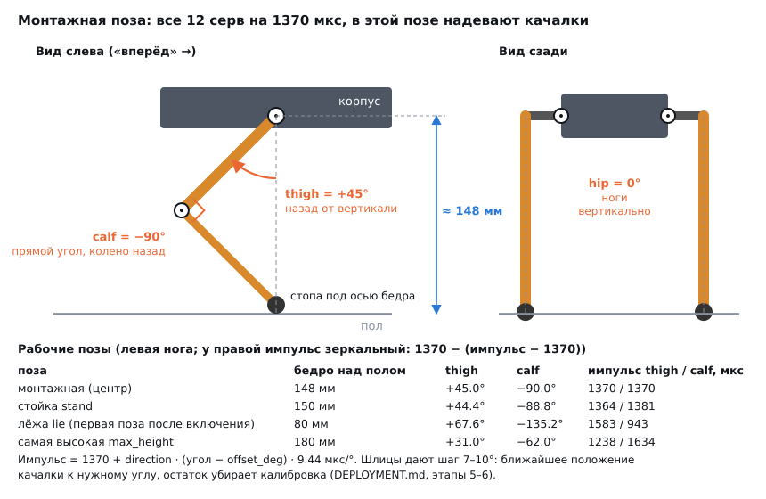
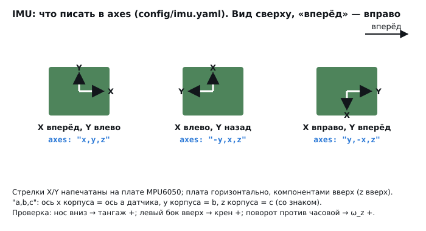
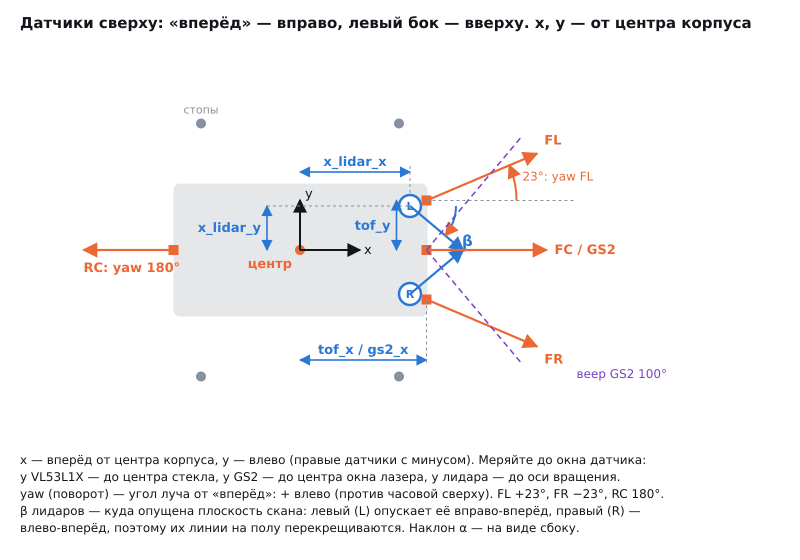
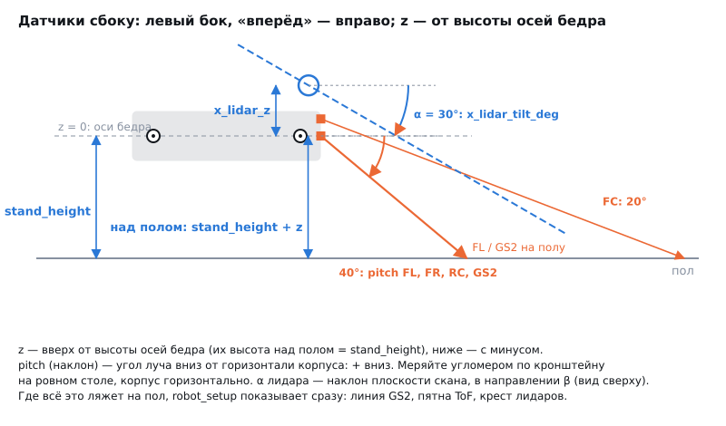

# Развёртывание на реальном роботе: план по этапам

План переносит v2 с симулятора на железо так, чтобы на каждом шаге рисковать как можно меньшим.
- Этапы идут по порядку. У каждого есть **критерий перехода**: пока он не выполнен, дальше не идём.
- «Откат» — что делать, если этап не проходит.
- Время указано примерное, для одного человека.
- Всё, что меняется в конфигах, сразу коммитится: так видно, с какими параметрами робот ходил.

Связанные документы:
- [HARDWARE.md](HARDWARE.md) — железо и что измерить;
- [CALIBRATION.md](CALIBRATION.md) — калибровка серв;
- [CONTROL.md](CONTROL.md) — пульты и цепочка безопасности;
- [TERRAIN.md](TERRAIN.md) — пределы рельефа;
- [COMPUTE.md](COMPUTE.md) — нагрузка на процессор.

## Карта этапов

| # | Этап | Где | Сервы под током | Время |
|---|---|---|---|---|
| 0 | Подготовка, инструменты, правила безопасности | стол | нет | 0.5 дня |
| 1 | Измерения и модель: размеры и масса → `robot.yaml` → проверка в симуляции | стол + ПК | нет | 0.5–1 день |
| 2 | Питание и проводка | стол | нет | 1 день |
| 3 | ОС, Docker, I2C на Banana Pi | стол | нет | 0.5 дня |
| 4 | Сборка образа и первый запуск без серв | ПК + робот | нет | 0.5 дня |
| 5 | Сервы по одной, установка качалок | стол | по одной | 0.5–1 день |
| 6 | Калибровка (камера или вручную) | подставка | да | 0.5 дня |
| 7 | IMU и датчик тока | подставка | да | 2–3 часа |
| 8 | Первые движения на подставке и проверка всей цепочки безопасности | подставка | да | 0.5 дня |
| 9 | Первые шаги на полу | пол, страховка | да | 0.5–1 день |
| 10 | Сверка с симуляцией и настройка походки | пол + ПК | да | 1–2 дня |
| 11 | Рельеф: уклоны и неровности по нарастающей | площадка | да | 1 день |
| 12 | Ресурсные испытания: батарея, нагрев, просадки | пол | да | 0.5–1 день |
| 13 | Эксплуатация: автозапуск, обновления, чек-лист | — | — | постоянно |
| 14 | Датчики из HEAD.md (лидары, ToF) — когда появятся | — | — | отдельно |

---

## Этап 0. Подготовка

**Инструменты:**
- мультиметр;
- лабораторный блок питания 6–8 В / 5 А с ограничением тока (очень желательно: первые включения серв делаются от него, а не от батареи);
- паяльник, термоусадка;
- штангенциркуль, угольник, транспортир;
- кухонные весы до 5 кг;
- рулетка, малярный скотч для разметки пола;
- подставка, на которой робот стоит корпусом, а ноги висят свободно (коробка 15–20 см);
- сумка для зарядки LiPo;
- ноутбук с Docker (для сборки образа и для `tools/autocal`);
- USB-камера или камера ноутбука.

**Проверить или купить** (подробности в [HARDWARE.md](HARDWARE.md), раздел «Питание»):
- **понижающий преобразователь для серв:** 6 В, 15–20 А (или два по 10 А: перёд и зад);
- **отдельный преобразователь 5 В / 3 А для Banana Pi:** просадки от серв не должны её перезагружать;
- предохранитель 20–25 А и выключатель в «+» батареи, разъёмы XT60;
- конденсатор 1000–2200 мкФ / 16 В на клемму V+ PCA9685;
- радиатор на процессор Banana Pi;
- запасная MG996R — одна-две сгорят почти наверняка;
- по желанию: INA226 с шунтом 10 мОм — датчик тока, узел сам его найдёт.

**Правила на всё время работ:**
1. **Робот без подставки — только с рукой рядом.** Первые включения — только на подставке.
2. **E-STOP всегда под рукой**, лучше два: пробел в браузере и кнопка на геймпаде (см. [CONTROL.md](CONTROL.md)).
3. **Порядок включения:**
   - Banana Pi и стек (сервы обесточены, стек стартует в режиме `passive`);
   - питание серв;
   - команда «Встать».
4. **Порядок выключения:**
   - «Лечь»;
   - E-STOP (сервы обесточены);
   - выключить питание серв;
   - выключить Banana Pi: `sudo poweroff`.
5. LiPo не разряжать ниже 3.5 В на банку и не оставлять на зарядке без присмотра.

**Критерий перехода:** всё из списка на столе, подставка готова.

---

## Этап 1. Измерения и модель

Цель — чтобы `robot.yaml` описывал настоящего робота, а симуляция с этими цифрами ходила. Если геометрия в конфиге неверна, походка на железе будет цеплять ногами и падать, и никакая калибровка это не исправит.

**Как вводить.** Параметры вносятся в форму: рядом с каждой группой полей та же схема, что ниже. Проверка идёт сразу, «Сохранить» пишет значения в `robot.yaml` и `servos.yaml`: комментарии остаются, старая версия сохраняется в `*.bak`.
```bash
python3 tools/robot_setup/robot_setup.py          # форма в браузере: http://localhost:8765
python3 tools/robot_setup/robot_setup.py --cli    # то же в терминале (по SSH на роботе)
python3 tools/robot_setup/robot_setup.py --check  # только проверить текущие файлы
```

**Что проверяет форма:**
- стойка по высоте достижима для ноги;
- углы стойки лежат внутри пределов суставов;
- колено в стойке согнуто на 60–100°;
- тяга замыкается;
- сумма масс сходится с весом на весах.

Если есть ошибки, форма не сохранит.

**Как мерить.** Все размеры — **между центрами осей**, а не до краёв деталей. Ось сервы — центр её вала; ось подшипника — центр отверстия. Штангенциркулем удобно мерить между винтами-осями и прибавлять диаметр одного винта: половина с одной стороны плюс половина с другой.

### Нога сбоку: `thigh`, `calf`, знаки углов

```
  Нога СБОКУ. Смотрим на ЛЕВЫЙ бок робота, «вперёд» → вправо.

        ┌───────────────── корпус ─────────────────┐
        │                  ◉ ← ось бедра (вал сервы thigh)          ─┬─
        └─────────────────/┊────────────────────────┘                │
                         /  ┊                                        │
          thigh ↗       /   ┊ ← вертикаль вниз = thigh 0°            │
         (ось бедра →  /  ⤹ ┊   угол thigh «+» = стопа уходит НАЗАД  │
          ось колена) /     ┊   (в стойке ≈ +44°)                    │ stand_height
                     /                                               │ (ось бедра → пол,
        ось колена  ◉ ← колено смотрит НАЗАД                         │  задаётся, не мерится)
                     ╲   ⤸ угол calf: 0° = нога прямая,              │
                      ╲    «−» = колено согнуто назад                │
          calf ↘       ╲   (в стойке ≈ −89°)                         │
         (ось колена →  ╲                                            │
          точка касания) ●  ← точка касания стопы с полом           ─┴─
   ═══════════════════════════════════════════════════════════════════════ пол
                                                         вперёд (x) ───▶
```

Подробная схема: [img/measure_leg_side.svg](img/measure_leg_side.svg)



1. **`thigh`** — от центра оси бедра (вал сервы thigh или ось, которую она вращает через тягу) до центра оси колена.
2. **`calf`** — от центра оси колена до **точки, которой стопа касается пола**. Удобно так: поставить голень вертикально на стол и померить высоту оси колена над столом.
3. **Направление колена:** сгибается назад → «Колено сгибается: −1».
4. **Знаки углов** нужны для пределов:
   - thigh 0 — бедро вертикально вниз, «+» — стопа уходит назад;
   - calf 0 — нога прямая, «−» — колено согнуто назад, −90° — прямой угол.

### Нога сзади: `hip_offset`, `hip_y`, знак угла hip

```
  Нога СЗАДИ. Смотрим на робота сзади: его ЛЕВЫЙ бок — слева.

           │◀─ hip_offset ─▶│◀────── hip_y ──────▶│
           ┊                ┊                     ┊
           ┃━━━━━━━━━━━━━━━━◉            ┌────────┊────────┐
           ┃                ↑            │     корпус      │
           ┃   ось отведения hip         └────────┊────────┘
           ┃   (идёт вдоль корпуса,               ┊
           ┃    «на нас»)                         ┊ середина корпуса
           ┃ ← плоскость, в которой               ┊
           ┃   ходят бедро и голень               ┊
     ⤺     ┃                                      ┊
  угол hip ┃
  «+» =    ●
  стопа ВЛЕВО (у левых ног — наружу, у правых — внутрь)
  ═════════════════════════════════════════════════════ пол
                                          ◀─── влево (y)
  hip_offset — от оси отведения до средней плоскости бедра и голени.
  hip_y      — от середины корпуса до оси отведения
               (= половина расстояния между осями отведения левой и правой ноги).
```

Подробная схема: [img/measure_leg_rear.svg](img/measure_leg_rear.svg)



1. **`hip_offset`** — поперёк корпуса: от оси отведения (она идёт вдоль корпуса) до средней плоскости, в которой ходят бедро и голень.
2. **`hip_y`** — от середины корпуса до оси отведения. Удобнее померить расстояние между осями отведения левой и правой ног и разделить на 2.
3. **Высота осей.** В модели ось отведения и ось бедра на одной высоте. Если на вашем роботе они разнесены по высоте больше чем на 5 мм — запишите это число и сообщите: модель придётся дополнить.
4. **Угол hip «+»** — стопа уходит **влево**: у левых ног наружу, у правых внутрь.

### Корпус сверху: `hip_x`, `hip_y`, центр корпуса

```
  Корпус СВЕРХУ. «Вперёд» → вправо, ЛЕВЫЙ бок — вверху.

      LR ‒‒‒●‒‒‒                                  ‒‒‒●‒‒‒ LF  ─┬─
         ┌──┊──────────────────────────────────────┊──┐        │ hip_y
         │  ┊               y ▲                    ┊  │        │
         │  ┊                 │                    ┊  │        │
         │  ┊                 ○───▶ x              ┊  │       ─┴─
         │  ┊          центр корпуса               ┊  │
         │  ┊                                      ┊  │
         └──┊──────────────────────────────────────┊──┘
      RR ‒‒‒●‒‒‒                 ┊                ‒‒‒●‒‒‒ RF
                                 ┊◀──── hip_x ──────▶┊

  ●    — точка, где ось бедра пересекает ось отведения (‒‒‒ — ось отведения, вдоль корпуса).
  центр корпуса — середина между четырьмя точками ●; от него же меряются датчики.
  hip_x — от центра до передних (и задних) точек вдоль корпуса = половина расстояния перёд–зад.
  hip_y — от центра до оси отведения поперёк                  = половина расстояния лево–право.
```

Подробная схема: [img/measure_body_top.svg](img/measure_body_top.svg)



1. **Центр корпуса** — середина между четырьмя точками, где оси бедра пересекают оси отведения. От него же меряется положение датчиков (раздел `sensors`).
2. **`hip_x`** — расстояние между осями бедра передней и задней ноги с одной стороны, делённое на 2.
3. **Длина, ширина, высота корпуса** и радиус стопы нужны только для модели (масса, инерция, картинка) — с точностью ±5 мм.

### Массы

Весы до 5 кг с точностью 1 г.
- **Корпус** — с платой, батареей, преобразователями и четырьмя сервами hip, без ног.
- **Звенья** — по одной ноге: hip-звено с сервой бедра, бедро с сервой колена, голень.
- **Весь робот** — для сверки: форма предупредит, если сумма отличается больше чем на 8 %.

Если ноги не снимаются, введите общую массу как массу корпуса минус оценку ног (MG996R весит 55 г).

### Пределы суставов

Сервы без питания. Рукой довести сустав до упора: в корпус, в соседнее звено, в тягу. Записать угол транспортиром по знакам со схем и **отступить 5°**. Для hip — отдельно «наружу» и «внутрь»: форма сама развернёт знаки для правых ног.

### Тяги (если сустав не на валу сервы)

```
  ТЯГА. Серва на ЦЕНТРАЛЬНОМ импульсе (pca9685_probe pulse <канал> 1370).

              ◀──────────────── rod_mm ────────────────▶
              ○━━━━━━━━━━━━━━━━━━━━━━━━━━━━━━━━━━━━━━━━━○   ○ — шарниры тяги
           ▲  ┃                                         ┃  ▲
servo_arm_mm  ┃ ← рычаг сервы                           ┃  joint_arm_mm
           ▼  ┃   ⌐ 90° к линии осей        рычаг сустава┃  ▼
              ◉ ┄┄┄┄┄┄┄┄┄┄┄┄┄┄┄┄┄┄┄┄┄┄┄┄┄┄┄┄┄┄┄┄┄┄┄┄┄┄┄┄┄◉
          ось (вал) сервы                            ось сустава
              ◀──────────── axis_distance_mm ────────────▶

  Все длины — между центрами осей и шарниров.
  servo_arm_mm = 0 — серва прямо на оси сустава (остальное не нужно).
  joint_arm_mm = 0 — рычаг сустава такой же, как у сервы; rod_mm = 0 — тяга = axis_distance_mm.
```

Подробная схема: [img/measure_linkage.svg](img/measure_linkage.svg)



- **Все четыре длины** — между центрами осей и шарниров. Серва на центральном импульсе (`pca9685_probe pulse <канал> 1370`); рычаг сервы должен быть перпендикулярен линии «ось сервы — ось сустава».
- **Если тяга колена опирается на корпус,** а не на бедро (серва колена стоит в блоке бедра), отметить «Тяга колена опирается на корпус». Тогда серва задаёт сумму углов «колено + бедро».

### Проверка в симуляции

После сохранения проверить на ПК, что робот с этими размерами ходит:
   ```bash
   cd ros2_ws && colcon build && source install/setup.bash
   ros2 launch dog_gazebo sim.launch.py headless:=true web:=false &
   ros2 run dog_gazebo walk_check                      # 8/8
   ros2 run dog_gazebo terrain_sweep --terrain slope --levels 10 --out slope.json
   colcon test --packages-select dog_control && colcon test-result   # в т.ч. JointSpeedsFitTheServos
   ```

**Критерий перехода:**
- `walk_check` 8/8 на новой геометрии;
- тесты `dog_control` зелёные;
- изменения закоммичены.

**Откат:** если с новой геометрией симуляция не ходит, уменьшить `gait.max_step` и `limits.max_vx`, увеличить `stance.stand_height`. Разобрать по [SIMULATION.md](SIMULATION.md), раздел «Как подбиралась походка».

---

## Этап 2. Питание и проводка

```
LiPo 2S/3S ── предохранитель 20–25 A ── выключатель ──┬── BEC 6 В / 15–20 А ── V+ PCA9685 (+1000–2200 мкФ)
                                                       │        (INA226 с шунтом 10 мОм в разрыв «+», если есть)
                                                       └── DC-DC 5 В / 3 А ── 5 В Banana Pi (пины 2/4 или USB-C)
Общая земля: батарея, оба преобразователя, PCA9685, Banana Pi.
I2C: Banana Pi SDA/SCL (шина 0) ── PCA9685 (0x40), MPU6050 (0x68), INA226 (0x41). VCC всех модулей = 3.3 В Banana Pi.
```

**Шаги:**
1. **Без серв и без Banana Pi** собрать силовую часть. Мультиметром проверить:
   - на выходе BEC 6.0 ± 0.1 В;
   - на выходе DC-DC 5.1 ± 0.1 В;
   - полярность на клемме V+.
2. **VCC PCA9685 — от 3.3 В Banana Pi, не от 5 В.** Подтяжки I2C на модуле идут к VCC. При 5 В на выводах процессора будет 5 В, и они сгорят (см. [HARDWARE.md](HARDWARE.md), раздел «Питание», п. 1).
3. **Провода I2C** — не длиннее 20–30 см, витая пара с землёй. Далеко от силовых проводов серв.
4. **MPU6050** закрепить жёстко, ближе к центру корпуса, платой параллельно корпусу. Записать, куда смотрят оси X и Y платы: это понадобится на этапе 7.
5. **Силовые провода** от BEC к V+ — сечением не меньше 1.5 мм² (16 AWG). Серв много, пиковый ток до 25 А.
6. Подключить Banana Pi, **сервы пока не подключать.**

**Критерий перехода:**
- напряжения в норме;
- ничего не греется за 5 минут без нагрузки;
- Banana Pi загружается от своего преобразователя.

**Откат:** если Banana Pi перезагружается при включении нагрузки, значит её питание связано с питанием серв. Развести преобразователи полностью.

---

## Этап 3. ОС, Docker, I2C на Banana Pi

1. **Образ Armbian bookworm (Debian 12)** для BPI-M4 Zero, как на v1 (минимальный, без рабочего стола). Записать на microSD класса A1/A2 от 32 ГБ (balenaEtcher или `dd`).
2. **Первая загрузка** (по UART, HDMI или SSH):
   - создать пользователя;
   - задать имя хоста, например `dog`;
   - часовой пояс;
   - `sudo apt update && sudo apt full-upgrade`.
3. **Сеть:** Wi-Fi через `nmtui`. Статический адрес или резерв в роутере. Проверить `ping dog.local` (avahi) с ноутбука.
4. **SSH по ключу:** `ssh-copy-id`. Вход по паролю можно отключить.
5. **I2C:**
   - `sudo armbian-config` → System → Hardware: включить I2C-оверлей 40-пинового разъёма, перезагрузиться;
   - `sudo apt install i2c-tools`;
   - `ls /dev/i2c-*`, затем `sudo i2cdetect -y 0` — должны быть видны **`40`** (PCA9685), **`68`** (MPU6050), `70` (служебный адрес PCA9685) и `41`, если стоит INA226;
   - если устройства на другой шине, скажем `/dev/i2c-1`, поменять путь в `docker-compose.yml` (`devices`) и `i2c.device` в `servos.yaml`, `imu.yaml`, `power.yaml`.
6. **Docker:**
   ```bash
   curl -fsSL https://get.docker.com | sh
   sudo usermod -aG docker $USER
   ```
   Перелогиниться, проверить `docker run --rm hello-world`.
7. **Время:** `sudo apt install chrony`. Точное время нужно для логов ROS и записи rosbag.
8. **Память:** 2 ГБ ОЗУ мало для сборки на плате. `sudo apt install zram-tools` или swap-файл на 2 ГБ.
9. **Тепло:** радиатор на процессор. Температуру смотреть командой `cat /sys/class/thermal/thermal_zone*/temp`. Под нагрузкой должно быть ниже 75 °C.
10. **Bluetooth-геймпад:** сопряжение через `bluetoothctl` (`scan on`, `pair`, `trust`, `connect`). Проверить, что появился `/dev/input/js0`.

**Критерий перехода:**
- `i2cdetect` видит 40 и 68;
- Docker работает;
- SSH по имени;
- геймпад виден как `js0`.

**Откат:** если нет I2C-устройств — проверить оверлей, VCC 3.3 В, SDA/SCL не перепутаны, земля общая. Если плата не видит ничего — прозвонить провода.

---

## Этап 4. Сборка образа и первый запуск без серв

**Сборка.** На плате она занимает 30–60 минут и упирается в память, поэтому лучше собирать на ноутбуке под arm64 (CI делает то же в задаче `robot-image`):
```bash
docker buildx build --platform linux/arm64 -f docker/Dockerfile -t robot-dog:2.0 --load .
docker save robot-dog:2.0 | gzip | ssh dog 'gunzip | docker load'
git clone <repo> && cd robot-dog        # на плате: нужны docker-compose.yml и config/
```
Запасной вариант — собрать прямо на плате: `docker compose build`. Файл `docker/Dockerfile` уже ограничивает параллельность сборки.

**Первый запуск без серв, в режиме mock** (PCA9685 не трогается):
```bash
docker compose run --rm robot ros2 launch dog_bringup robot.launch.py backend:=mock web:=true gamepad:=true
```
Проверить:
1. Открывается веб-страница `http://dog.local:8080`, «Встать», «Лечь» и стик меняют состояние.
2. Геймпад: `docker compose exec robot ros2 topic echo /dog/joy`. Кнопки и оси совпадают с [CONTROL.md](CONTROL.md). Если нет — `gamepad_profile:=ps` или поправить `teleop.yaml`.
3. Клавиатура по SSH: `docker compose exec robot ros2 run dog_teleop keyboard_teleop --ros-args -r __ns:=/dog`.
4. Нагрузка: `top -H`, пока в mock идёт ходьба. Записать базовую загрузку CPU (ожидание 0.6–0.8 ядра, см. [COMPUTE.md](COMPUTE.md)) и температуру.

**Проверка PCA9685 без серв:**
```bash
docker compose run --rm robot ros2 run dog_hardware pca9685_probe check     # чип отвечает, 50 Гц
```
Щупом осциллографа или мультиметром в режиме частоты на сигнальном выводе канала 0 после `pulse 0 1370` должно быть 50 Гц. Затем `pca9685_probe off`.

**Критерий перехода:**
- стек работает в mock;
- все три пульта управляют;
- `pca9685_probe check` проходит;
- загрузка CPU записана.

---

## Этап 5. Сервы по одной и установка качалок

Самое частое повреждение на этом этапе — серва, которая при первом включении уходит в упор и ломает качалку или звено. Поэтому:

1. **Питание серв — от лабораторного блока** 6 В с ограничением тока 2–3 А, не от батареи.
2. **Сервы подключаются без качалок** (или с отсоединёнными тягами). По каждому каналу 0…11:
   ```bash
   docker compose run --rm robot ros2 run dog_hardware pca9685_probe pulse <канал> 1370   # центр
   ```
   - серва встаёт в центр;
   - ток покоя 5–30 мА, при движении до 0.5–1 А;
   - заодно проверяется раскладка каналов (таблица в [HARDWARE.md](HARDWARE.md), раздел «Каналы»).
3. **При центральном импульсе (1370 мкс) надеть качалку так, чтобы сустав стоял в монтажной позе** — таблица и схемы ниже, раздел «Монтажная поза». Коротко: hip — нога вертикально, thigh — бедро на 45° назад от вертикали, calf — колено согнуто на 90°. Шлицы дают шаг ~7–10°: выбрать положение шлица, ближайшее к нужному углу; остаток уберёт калибровка (этап 6).
4. **Качнуть каждую серву** импульсами 1370 ± 200 мкс (≈ ±20°). Звено не должно упираться. Если упирается — сузить `min_deg`/`max_deg` в `servos.yaml` до калибровки. Для thigh и calf дополнительно выставить крайние рабочие позы из таблицы ниже: «лёжа» (левая нога thigh 1583, calf 943 мкс; правая 1157 / 1797) и «самая высокая» (1238 / 1634; правая 1502 / 1106).
5. `pca9685_probe off` после каждой сервы.

### Монтажная поза: какой угол у сустава при центре сервы

Центр сервы (1370 мкс) = середина её хода 180°. Качалку надевают так, чтобы в центре сустав стоял **в рабочей стойке**: тогда ход сервы ±90° делится поровну вокруг позы, в которой нога проводит почти всё время. Эти углы и записаны в `servos.yaml` как `offset_deg` («угол сустава при центральном импульсе»):

| Сустав | Угол при 1370 мкс (`offset_deg`) | Как выглядит | Ход сервы ±90° даёт | Программный предел (`min_deg…max_deg`) |
|---|---|---|---|---|
| hip (0, 3, 6, 9) | **0°** | нога висит строго вертикально, если смотреть спереди/сзади | −90…+90° | −40…+40° |
| thigh (1, 4, 7, 10) | **+45°** | бедро отклонено на 45° **назад** от вертикали (колено позади оси бедра) | −45…+135° | −45…+135° |
| calf (2, 5, 8, 11) | **−90°** | голень под **прямым углом** к бедру, колено согнуто назад, стопа под осью бедра | −180…0° | −165…−15° |

Одинаково для всех четырёх ног. Правые сервы стоят зеркально, поэтому у них `direction: -1`: при том же импульсе правая нога в той же позе, что и левая, а рост импульса двигает её в обратную сторону.

```
  Монтажная поза, вид СЛЕВА (вперёд →). Все 12 серв на 1370 мкс.

        ┌──────────────────── корпус ────────────────────┐
        │   ◉ ← ось бедра (thigh)          ◉            │
        └──╱┊─────────────────────────────╱┊────────────┘
          ╱ ┊ 45°                         ╱ ┊
         ╱  ┊ ← вертикаль                ╱  ┊            thigh = +45°
  колено ◉  ┊                     колено ◉  ┊            (бедро назад)
          ╲ ┊ ∟ 90°                       ╲ ┊
           ╲┊                              ╲┊            calf = −90°
            ●  стопа под осью бедра          ●           (прямой угол)
   ══════════════════════════════════════════════════ пол
     высота оси бедра над полом ≈ 0.148 м = почти стойка (0.15 м)
```

```
  Вид СЗАДИ, hip = 0°: обе ноги строго вертикально.

        ┌──────── корпус ────────┐
   hip ◉│                        │◉ hip
       ─┤                        ├─   ← hip_offset 55 мм до плоскости ноги
        ┃                        ┃
        ┃                        ┃
        ●                        ●
   ══════════════════════════════════ пол
```



Рабочие позы в углах суставов (для `thigh = calf = 105 мм`, стопа под осью бедра) и импульсы левой ноги (у правой — зеркально: 1370 − (импульс − 1370)):

| Поза | Высота оси бедра | thigh | calf | импульс thigh / calf (левая нога), мкс |
|---|---|---|---|---|
| монтажная (все сервы в центре) | 0.148 м | +45.0° | −90.0° | 1370 / 1370 |
| стойка `stand` (`stand_height`) | 0.15 м | +44.4° | −88.8° | 1364 / 1381 |
| лёжа `lie` (`lie_height`) | 0.08 м | +67.6° | −135.2° | 1583 / 943 |
| самая высокая (`max_height`) | 0.18 м | +31.0° | −62.0° | 1238 / 1634 |
| самая низкая в движении (`min_height`) | 0.10 м | +61.6° | −123.1° | 1527 / 1057 |

Импульс = 1370 + direction · (угол − offset_deg) · 9.44 мкс/° (1700 мкс на 180°). hip во всех позах 0° (1370 мкс), пока нет крена и боковых шагов.

**Если сустав на тяге:** в центре сервы её качалка ставится **перпендикулярно** линии «ось сервы — ось сустава», а сустав — в угол из таблицы. На этом допущении драйвер пересчитывает тягу (см. комментарий в `servos.yaml`).

### Что происходит после включения

| Шаг | Что делает софт | Что делают сервы | Что должен сделать человек |
|---|---|---|---|
| 1. Подано питание серв, стек ещё не запущен | PCA9685 после сброса импульсов не выдаёт | **без импульса — «мягкие»**, ноги под весом складываются | робот лежит на животе или стоит на подставке |
| 2. Запущен стек (`servo_driver`, `locomotion`) | `locomotion` в режиме `passive`, углы не публикует; драйвер держит выходы выключенными | по-прежнему мягкие | сложить ноги руками примерно в позу «лёжа» (таблица выше) — тогда первый рывок будет маленьким |
| 3. Первая команда `lie` или `stand` | первая поза всегда **«лёжа»** (0.08 м): thigh +67.6°, calf −135.2°, hip 0° | включаются **по ногам**: LF → RF → LR → RR с шагом 0.15 с (`enable_stagger`), чтобы не просадить питание. Каждая серва идёт в цель **на своей полной скорости** — её текущий угол драйверу неизвестен | не держать ноги руками |
| 4. `stand` | переход «лёжа → стойка» за 1.5 с (`transition_time`), дальше скорость суставов ограничена 6 рад/с (`max_joint_speed`) | плавно встаёт до 0.15 м: thigh +44.4°, calf −88.8° | — |
| 5. Команды пропали > 0.5 с (`command_timeout`) | драйвер держит последнюю позу | держат | — |
| 6. E-stop или остановка драйвера | выходы выключаются (`relax_on_exit: true`) | снова мягкие, робот оседает | перед остановкой — `lie`, чтобы не падать со стойки |

Отсюда два правила сборки:
- **Качалку надевать только на серву под импульсом 1370 мкс**, иначе монтажная поза не совпадёт с `offset_deg`, и на шаге 3 нога уйдёт не туда.
- **До первого включения проверить ход** из монтажной позы в «лёжа» и в «самую высокую» (пункт 4 ниже): это крайние позы, которые робот займёт сам. В «лёжа» колено согнуто на 135° — голень не должна упираться в бедро или корпус.

**Критерий перехода:**
- все 12 серв отвечают на своём канале;
- качалки надеты в монтажной позе (таблица выше);
- нигде нет упора в диапазоне ±20°;
- ни одна серва не гудит в покое.

**Откат:**
- серва гудит или греется в покое — механическое напряжение или неисправность, заменить;
- канал не тот — поменять `channel` в `servos.yaml`, а не перепаивать.

---

## Этап 6. Калибровка

Робот на подставке, ноги висят. Сервы от лабораторного блока (3–5 А) или от BEC с батареей.

**Вариант А — автоматически камерой** (рекомендую, [tools/autocal](../tools/autocal/README.md)):
1. Распечатать листы меток: `python3 -m robotdog_autocal markers`. Наклеить метки по схеме из README: бедро, колено, стопа, торцы корпуса.
2. Откалибровать камеру по шахматке: `camera-calib`. Без этого точность хуже, но работает.
3. `preview --view left`: все метки видны, углы похожи на правду.
4. Запустить стек в обычном режиме (сервы под током, `passive`) и затем:
   ```bash
   python3 -m robotdog_autocal run --robot dog.local --view all --passes 2 --apply --find-limits \
       --servos-yaml ros2_ws/src/dog_bringup/config/servos.yaml
   ```
   Программа попросит поставить камеру спереди, сзади, слева и справа.
5. Проверить результат: `calib_pose 0 30 -90`. Все ноги одинаково, по угольнику.

**Вариант Б — вручную** по [CALIBRATION.md](CALIBRATION.md): `calib_pose`, `ros2 param set ... direction/offset_deg`, угольник.

После калибровки — `git commit` файла `servos.yaml`.

**Критерий перехода:**
- в стойке все четыре ноги одинаковы с точностью 1–2°;
- `calib_pose 15 0 -90` уводит **все** стопы влево;
- `calib_pose 0 20 -90` — назад;
- пределы найдены;
- `servos.yaml` закоммичен.

---

## Этап 7. IMU и датчик тока

Оба узла стартуют сами, если датчик найден на шине. В логе будет `IMU: MPU6050-family ... measuring gyro bias` и `power monitoring on INA226 ...`.

**IMU:**
1. Стек запущен, робот неподвижен первую секунду: в это время меряется смещение гироскопа.
2. Проверить оси:
   ```bash
   docker compose exec robot ros2 topic echo /dog/imu/data --field orientation
   ```
   - наклонить нос вниз → тангаж положительный;
   - поднять левый бок → крен положительный (REP-103).

   Если нет — поменять `axes` в `config/imu.yaml` по схеме ниже и перезапустить.

   ```
   IMU, вид СВЕРХУ, «вперёд» → вправо. Стрелки X/Y напечатаны на плате MPU6050,
   плата горизонтально, компонентами вверх.

      X вперёд, Y влево        X влево, Y назад         X вправо, Y вперёд
          Y ▲                      X ▲                      
            │                        │                        │
            └──▶ X             Y ◀───┘                        └──▶ Y
                                                              ▼ X
      axes: "x,y,z"            axes: "-y,x,z"           axes: "y,-x,z"

   "a,b,c": ось x корпуса = ось a датчика, y корпуса = b, z корпуса = c (со знаком).
   ```

   Подробная схема: [img/measure_imu_axes.svg](img/measure_imu_axes.svg)

   
3. Покрутить робота вокруг вертикали: знак `angular_velocity.z` положительный при повороте против часовой стрелки. От этого зависит удержание курса: если знак неверный, робот будет «удерживать» курс в обратную сторону и закручиваться.
4. Частота: `ros2 topic hz /dog/imu/data` ≈ 100 Гц.

**Датчик тока** (если стоит):
1. `ros2 topic echo /dog/power`. Напряжение совпадает с мультиметром ±0.05 В.
2. Все ноги в «Встать»: ток покоя 1–3 А. Ток в ходьбе на подставке запомнить: от него зависят пороги.
3. Пороги в `config/power.yaml`: `overcurrent_a` примерно в 1.5 раза выше пикового тока нормальной ходьбы (по умолчанию 5 А за 0.5 с).

**Критерий перехода:**
- оси IMU проверены по трём движениям;
- знак гироскопа Z верный;
- ток и напряжение правдоподобные.

---

## Этап 8. Первые движения на подставке и цепочка безопасности

Для первых движений в `robot.yaml` временно снизить скорости и вернуть их на этапе 10:
```yaml
limits: {max_vx: 0.05, max_vy: 0.03, max_wz: 0.3}
```

1. **«Встать» на подставке:**
   - ноги плавно выпрямляются в стойку, без рывков;
   - в журнале нет `joint(s) clamped` (иначе пределы или геометрия неверны);
   - нет `foot target(s) outside the leg workspace`.
2. **«Лечь» и снова «Встать»**, 3 раза.
3. **Ходьба в воздухе:** все направления и развороты. Смотреть:
   - ноги двигаются парами по диагонали;
   - нет щелчков и ударов в концах хода;
   - сервы через 5 минут тёплые, но не горячие: < 50–60 °C на ощупь, корпус можно держать.
4. **Проверить каждую строку таблицы безопасности** из [CONTROL.md](CONTROL.md):

   | Проверка | Ожидание |
   |---|---|
   | Отпустить deadman на геймпаде | шаг останавливается |
   | Выключить геймпад (Bluetooth) | стоп через 0.5 с |
   | Закрыть вкладку браузера или выключить Wi-Fi на телефоне | стоп через 0.4 с |
   | Ctrl-C в клавиатурном пульте | стоп |
   | `docker compose restart` посреди ходьбы | сервы отпускаются, после перезапуска `passive` |
   | E-STOP с каждого пульта | сервы обесточены сразу; «Встать» не работает, пока E-STOP не снят |
   | Выключить питание серв, потом включить | стек не падает; после «Встать» всё работает |
5. **Если стоит датчик тока** — зажать рукой одну ногу при «Встать». Через ~0.5 с должен сработать E-STOP по перегрузке.

6. **Приветствие на подставке** (`greet`, кнопка «Привет»). Сначала осмотреть колени задних ног: робот садится на них, голень ложится на пол. На колене не должно быть тяги, наконечника или качалки, которые упрутся в пол; при необходимости наклеить резиновую накладку. На подставке проверить только движения ног: без щелчков в концах хода, в журнале нет `foot target(s) outside the leg workspace`. На пол — на этапе 10, со страховкой рукой за корпус ([GAITS.md](GAITS.md)).

**Критерий перехода:** все проверки таблицы пройдены, сервы не перегреваются за 10 минут ходьбы в воздухе.

---

## Этап 9. Первые шаги на полу

Ровный пол с хорошим сцеплением (ламинат или линолеум, не ковёр). Второй человек или страховочная лента на корпусе.

1. «Встать» на полу. Корпус ровный, высота около `stand_height`. Замерить линейкой.
2. **Вперёд на 0.03–0.05 м/с, 1–2 м.** Смотреть:
   - ноги не скользят, стопы не цепляют пол при переносе;
   - корпус не заваливается;
   - в логе нет `clamped`.
3. Назад, влево, вправо, разворот. Потом «Лечь».
4. Если **робот уходит вбок или разворачивается** — это ожидаемо без IMU. С IMU удержание курса включено само; сравнить, стоя на скотче-разметке.
5. Записать первый rosbag для сверки с симуляцией:
   ```bash
   docker compose exec robot ros2 bag record -o /tmp/walk1 /dog/joint_commands /dog/joint_states /dog/imu/data /dog/power /dog/state /dog/cmd_vel
   ```

**Критерий перехода:** 5 минут ходьбы на малой скорости по всем направлениям без падений и без `clamped`.

**Откат:**
- колени проскальзывают, робот садится — сервы не держат (мало напряжения или момента), поднять `stance.stand_height` на 1 см;
- стопы цепляют — увеличить `gait.step_height` на 5 мм (но в симуляции это ухудшало устойчивость, см. [TERRAIN.md](TERRAIN.md));
- раскачивается — увеличить `gait.duty` до 0.7.

---

## Этап 10. Сверка с симуляцией и настройка

1. **Реальные скорости.** Разметить на полу 2 м, скомандовать 0.05, 0.08, 0.10, 0.12 м/с, засечь время. Сравнить с долей «от команды» в [SIMULATION.md](SIMULATION.md). То же для разворота: угол за 5 с при 0.5 рад/с.
2. **Удержание курса.** 3 прохода по 2 м вперёд с `heading.hold: true` и 3 с `false`. Мерить отклонение от линии в конце. В симуляции было ≤ 9° с удержанием против до 22° без.
3. **Модель.** Вписать в `robot.yaml` → `description` измеренные массы. Повторить `walk_check` в симуляции: походка на новой модели должна проходить. Если реальный робот ведёт себя заметно хуже симуляции, записать почему — это лучший материал для улучшения модели.
4. **Настройка походки** — менять по одному параметру и записывать каждое изменение:
   - `gait.period` 0.5–0.65;
   - `gait.duty` 0.6–0.7;
   - `gait.step_height` 15–25 мм;
   - `stance.stand_height`;
   - вернуть `limits` к рабочим значениям.
5. **Нагрузка.** `top -H` при ходьбе с геймпадом и открытой веб-страницей. Цель: суммарно < 1.5 ядра, температура < 75 °C.
6. **Приветствие на полу**, рука у корпуса: колени и задние стопы на полу, передние лапы поднимаются только когда корпус откинулся; робот не заваливается назад. Если заваливается — уменьшить `greet.beg_deg`, если вперёд — увеличить `greet.sit_deg` на 5°.
7. **Ползание на ровном** (`crawl`, кнопка «Ползком»): 1 м вперёд. Одна нога в воздухе, корпус перед подъёмом ноги смещается над три другие. Скорость около 1 см/с — так и задумано ([GAITS.md](GAITS.md)).

**Критерий перехода:**
- робот идёт вперёд на 0.1 м/с с отклонением не больше 10° на 2 м;
- все манёвры работают;
- параметры закоммичены.

---

## Этап 11. Рельеф по нарастающей

По [TERRAIN.md](TERRAIN.md), начиная с последней строки таблицы («реальный робот: начать с»):
1. **Уклон** — доска на подставке, угол по транспортиру или приложению-уровню:
   - 4°, 7°, 10° — вверх и вниз по линии склона;
   - поперёк склона — только после этого, и не выше 7°.
2. **Неровности:** рейки 7 мм, потом 10, 15 мм; мелкий гравий или камешки на ковролине.
3. **Ступени ползанием** (с датчиками этапа 14 или вручную `crawl`): одна ступень 30, 40, 50 мм вверх и вниз, потом брусок 40–60 мм. В симуляции подъём по лестнице 50 мм проходил, **спуск — нет** (опорные стопы уползают к кромке, [GAITS.md](GAITS.md)): вниз — только со страховкой.
4. **На каждом шаге:** 3 прохода. Если хоть один раз падение или сход вбок больше 15 см — остаёмся на предыдущем уровне.
5. Записать реальные пределы в таблицу [TERRAIN.md](TERRAIN.md) рядом с симуляцией.

**Критерий:** реальные пределы записаны; ни одного падения на рекомендованных уровнях.

---

## Этап 12. Ресурсные испытания

1. **Батарея.** Ходьба по кругу с полной батареи до срабатывания «Лечь» по низкому напряжению или до 3.5 В на банку. Записать время и `/dog/power` (rosbag).
2. **Нагрев.** Каждые 5 минут — температура серв (термометр или термопара), BEC и процессора.
   - Серва горячее 70 °C — перерыв.
   - Коленные сервы греются первыми: у них самый большой момент.
3. **Просадка питания.** От лабораторного блока плавно снижать напряжение серв с 6 до 5 В. На 5 В за 0.3 с робот должен лечь сам (`undervoltage_v`), а Banana Pi не должна перезагрузиться.
4. **Долгий прогон** — 30 минут с перерывами. В логе не должно быть ошибок I2C (`read failed`, `write failed`).

**Критерий:** известны время работы от батареи и нагрев, защита по напряжению срабатывает, ошибок шины нет.

---

## Этап 13. Эксплуатация

- **Автозапуск:** `docker compose up -d`. `restart: unless-stopped` поднимает стек после загрузки. Сервы при старте обесточены.
- **Обновление:** на ноутбуке собрать образ (этап 4), на плате — `git pull && docker compose up -d`. Конфиги монтируются с хоста, поэтому правка `servos.yaml` или `robot.yaml` требует только `docker compose restart`.
- **Резервная копия:** `config/` в git. Образ SD-карты после этапа 10 — `dd` на ноутбук.
- **Логи:** `docker compose logs -f`. Для разборов — rosbag, как на этапе 9.
- **Чек-лист перед каждым выходом:**
  1. Батарея ≥ 3.8 В на банку.
  2. Винты качалок затянуты, тяги без люфта.
  3. `i2cdetect` видит всё, в логе при старте найдены IMU и датчик тока.
  4. E-STOP проверен одним нажатием.
  5. На подставке «Встать» → «Лечь».

---

## Этап 14. Датчики из HEAD.md (когда появятся)

Порядок по [HEAD.md](HEAD.md) и [PERCEPTION.md](PERCEPTION.md):
1. **VL53L1X FL/FR:**
   - напечатать кронштейны с углами 40°/23°, подключить к I2C с XSHUT;
   - написать узел `tof_node` с автопоиском и публикацией `tof/<имя>`, как в симуляции;
   - снять поправки на ровном полу: `perception.debug_topics: true`, робот стоит, среднее `residual` по каждому датчику из `perception/tof` за 10 с — в `robot_setup` («Поправка ToF»);
2. **Лидары крестом:**
   - кронштейны α = 30°, β = 40°, драйвер `ldlidar_stl_ros2` → `lidar_left/scan`, `lidar_right/scan`;
   - откалибровать углы установки по ровному полу;
   - в драйвере или в узле довернуть каждую точку оборота по IMU.
   - **шина I2C:** PCA9685, IMU, датчик тока и четыре VL53L1X на одной шине. Перевести её на 400 кГц и проверить задержки (`i2cdetect`, логи `read failed`); если GS2 заменит передние ToF, на шине останется только RC.
2. **GS2** (если выбран вместо передних ToF): кронштейн 40° вниз на центре передней грани, стабилизатор 3.4 В, драйвер [EaiRosForGS2](https://github.com/YDLIDAR/EaiRosForGS2) → `gs2/scan`. Где ляжет линия, покажет `robot_setup`.
3. **Лидары крестом:**
   - кронштейны α = 30°, β = 40°, драйвер `ldlidar_stl_ros2` → `lidar_left/scan`, `lidar_right/scan`;
   - откалибровать углы установки по ровному полу;
   - в драйвере или в узле довернуть каждую точку оборота по IMU (`time_increment` в LaserScan).
4. **Положения датчиков** ввести в `robot_setup` (группа «Датчики»): оттуда их берут и узел, и симуляция. Как мерить:

   ```
   СВЕРХУ («вперёд» → вправо, левый бок вверху)          СБОКУ (левый бок)
                        FL ↗ yaw +23°                            L ◯ ╲  плоскость лидара,
          y ▲        ┌────────■                             x_lidar_z │  ╲ наклон α = 30°
            │  L ◯───┤ tof_y  │── FC / GS2 → yaw 0       z=0 ●────────■╲─╲─── оси бедра
      RC ←■ ●──▶ x   │        ■                                │       ╲ 40°  pitch: вниз +
            центр R ◯┘        FR ↘ yaw −23°             stand_ │        ╲
            ├─ x_lidar_x ─┤                              height │         ╲
            ├──── tof_x / gs2_x ────┤                   ════════╧══════════● пол
   ```

   - **x** — вперёд от центра корпуса (середина между осями бедра), **y** — влево, **z** — вверх от высоты осей бедра;
   - меряется до окна датчика: у VL53L1X — центр стекла, у GS2 — центр окна лазера, у лидара — ось вращения;
   - **yaw** — поворот луча от «вперёд», + влево; **pitch** — наклон луча вниз от горизонтали корпуса, + вниз (угломер по кронштейну, корпус на ровном столе);
   - **β** лидаров — куда опущена плоскость скана: левый опускает её вправо-вперёд, правый — влево-вперёд; **α** — насколько.

   Подробные схемы: [img/measure_sensors_top.svg](img/measure_sensors_top.svg), [img/measure_sensors_side.svg](img/measure_sensors_side.svg)

   

   
5. **`perception_node`** (C++): `ros2 launch dog_bringup robot.launch.py perception:=true`.
   - одометрия `odom` на роботе — счисление по походке и курсу IMU (`locomotion`, `odom.publish`), её дрейф ~10–40 % пройденного;
   - сначала `perception.guard: false` и смотреть `perception/hazards` на ровном полу 5 минут: ложных сообщений быть не должно;
   - затем `guard: true`, осторожные настройки: `guard_slow_vx: 0.06`, `guard_stop_dist: 0.35`.
6. **Сверка с симуляцией:** доска 80 мм — робот стоит в 0.15–0.25 м от неё (в Gazebo 0.16 м); брусок 20 мм — медленно, высокий шаг только у ног на его линии; ровный пол — ни одной реакции. На веб-пульте видно состояние реакции (плашка рядом с режимом).

---

## Риски и что делать

| Риск | Признак | Что делать |
|---|---|---|
| Просадка питания перезагружает плату | перезагрузка при «Встать» или ходьбе | развести питание (этап 2), конденсатор на V+, BEC мощнее |
| Серва сгорела или сорвала шлицы | гудит, греется, не держит | замена; проверить, не упирается ли звено; сузить пределы |
| Геометрия в конфиге не совпадает с роботом | `clamped`, стопы цепляют, робот садится | вернуться к этапу 1, перемерить |
| Оси IMU перепутаны | робот закручивается, на склоне хуже, чем без IMU | этап 7, `axes`; временно `heading.hold: false`, `slope.compensation: false` |
| Нагрузка на CPU | походка дёргается при открытой веб-странице | `top -H`; закрыть лишнее; см. [COMPUTE.md](COMPUTE.md) (микроконтроллер для реального времени) |
| Помехи на I2C | `read failed` в логе | укоротить провода, витая пара, подальше от силовых проводов; снизить частоту шины до 100 кГц |
| Wi-Fi пропадает | стоп по таймауту веб-пульта | это правильная реакция; геймпад по Bluetooth надёжнее |
