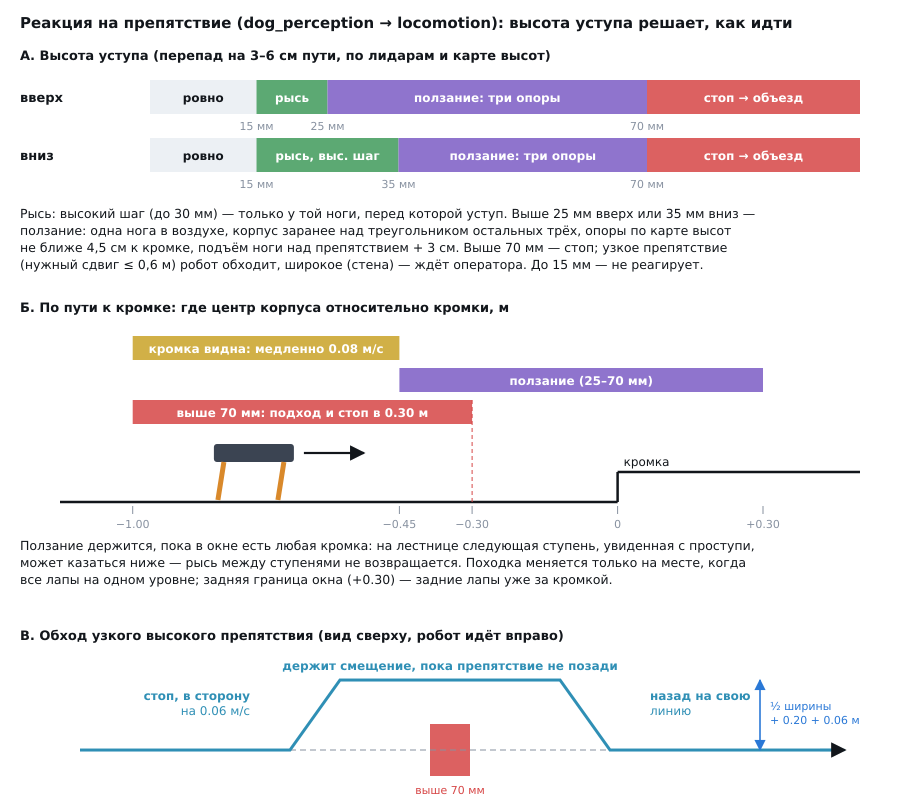
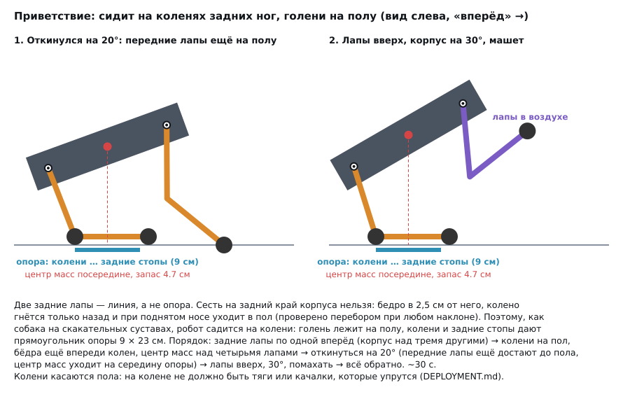

# Походки: рысь, ползание, объезд, приветствие

Рысь (основная походка) описана в [ARCHITECTURE.md](ARCHITECTURE.md), её пределы на рельефе — в [TERRAIN.md](TERRAIN.md). Здесь — то, что добавлено для препятствий выше 25 мм и для приветствия: медленная походка на трёх опорах (ползание), объезд высоких препятствий и поза «сидит, лапы вверх».

## Какая походка когда



Решает узел восприятия (guard, [PERCEPTION.md](PERCEPTION.md)) по высоте уступа — скачку профиля за 3–6 см пути, а не по высоте над полом:

| Уступ вверх / вниз | Что делает робот |
|---|---|
| до 15 мм | ничего: шум |
| до 25 / 35 мм | рысь; высокий шаг (до 30 мм) — только у ноги, перед которой уступ |
| до 70 мм | **ползание**: одна нога в воздухе, корпус заранее над тремя другими |
| выше 70 мм | **стоп**; узкое препятствие (нужный сдвиг ≤ 0,6 м) робот **обходит**, широкое (стена) — ждёт оператора |

Рысь с подъёмом ноги выше 30 мм опрокидывается: в фазе переноса она стоит на диагональной паре, а это линия, а не опора. Поэтому всё выше 25 мм — отдельной походкой.

Походка меняется только на месте: скорость обнуляется, переключение происходит, когда шаг закончен и все стопы на одном уровне. Оператор может выбрать ползание и сам (`crawl` / `trot`, кнопка «Ползком» в веб-пульте).

## Ползание (`dog_control/crawl.hpp`)

**Порядок ног** ЛЗ → ЛП → ПЗ → ПП. В воздухе всегда одна нога. Перед подъёмом ноги корпус смещается так, чтобы центр масс был внутри треугольника трёх остальных ног не ближе 3,5 см к его краю. Запас считается и на момент постановки ноги: корпус продолжает идти вперёд, пока нога в воздухе. Сдвиг корпуса минимальный, а не к центру треугольника (подробнее ниже). Если запас во время переноса всё же падает (длинный шаг), корпус ждёт. Нога не поднимается, пока корпус не встал над опорой.

**Опоры по рельефу.** `perception_node` публикует `terrain/profile`: высоты карты под левыми и правыми стопами от −0,3 до +0,7 м (шаг 2 см). Точка постановки ноги ищется так:
- стопа ставится туда, где в окне ±4,5 см перепад меньше 8 мм. Окно широкое по трём причинам: карта смазывает кромку на 1–2 см, стопа ложится на 1–2 см мимо, опорная стопа «уползает» перед подъёмом;
- сначала ищется место дальше по ходу (передние ноги до +5 см, задние до +3 см), потом ближе (до −12 см). Задняя нога, поставленная слишком далеко вперёд, лишает корпус опоры сзади. А нога, поставленная перед подступенком, на следующем шаге упрётся в него снова;
- если ровного места нет, выбирается наименее неровное; неизвестная высота рядом считается кромкой;
- разрыв в профиле между двумя известными участками («тень» лидаров) заполняется меньшей из соседних высот. Тень за брусом получает высоту пола, тень за кромкой спуска — высоту нижней ступени, так что кромка остаётся на месте.

**Перенос ноги**: сначала вверх, потом вперёд, потом вниз. Нога поднимается выше самой высокой точки профиля на пути на 3 см, но не больше чем на 10 см над опорой. Высокий подъём идёт медленнее, до двух длительностей переноса: сервы и так работают на пределе скорости, и нога, пошедшая вперёд раньше, чем поднялась, цепляет брус.

**Корпус** держится на стоечной высоте над средней высотой четырёх опор и наклоняется вдоль лестницы, не больше чем на 8,6° (0,15 рад). Тогда передние и задние ноги ближе к рабочей высоте.

**Скорость** ~1,1 см/с: шаг 10 см за цикл из четырёх ног, длина шага считается по реальной длительности последних четырёх фаз.

Параметры — `robot.yaml`, раздел `crawl` (`robot_setup` их не трогает).

### Что нашла симуляция

| Что было | Чем грозило | Что стало |
|---|---|---|
| Нога поднималась не позже чем через 3 × `shift_time`, даже если корпус ещё не над опорой | падение при медленном переносе корпуса | нога поднимается, только когда корпус над тремя другими |
| Корпус трогался рывком: скорость сразу 0,12 м/с | стопы проскальзывали, курс уходил на 8° за полсекунды | разгон 0,3 м/с² и скорость 0,06 м/с |
| Корпус каждый такт уходил к центру треугольника (~8 см за фазу) | все четыре сервы работают одновременно, их отставание разное, и опорные стопы тянут друг друга | сдвиг только до нужного запаса; остальное время корпус идёт вперёд плавно |
| Гироскоп (100 Гц) читался раз в такт управления (50 Гц) | короткие рывки при срыве стопы терялись: курс уходил на 20–30° при нулевой ошибке в контроллере | каждый отсчёт интегрируется по меткам времени IMU |
| Компенсация уклона работала и в ползании | собственный наклон корпуса на лестнице читался как уклон, и все стопы сдвигались на 2–3 см мимо выбранных опор, прямо на кромки | в ползании отключена: походка сама держит корпус над опорой в горизонтальных координатах |
| Цель переноса стояла на месте в системе корпуса | стопа садилась на 7–8 мм дальше плана | цель переноса движется вместе с землёй |
| Опоры: окно ±2 см, порог 12 мм, неизвестное = ровное | лапы вставали на смазанные кромки и в «тень» за кромкой спуска | окно ±4,5 см, порог 8 мм, неизвестное рядом = кромка, тень заполняется |
| Поиск опоры сначала назад | задняя нога вставала перед подступенком, отставала на 19 см, и опора растягивалась до опрокидывания | сначала за кромку (в пределах), потом ближе |
| Охранник возвращал рысь, когда следующая ступень казалась ниже 25 мм | робот переходил на рысь между ступенями и падал | пока в окне есть любая кромка, ползание держится |
| Нога не успевала подняться над брусом 60 мм | стопа вставала на брус | подъём 35 % переноса, горизонталь после него, запас 3 см, высокий перенос медленнее |

### Удержание курса в ползании

Цикл ползания длинный (~9–10 с), и поворачивает походка только опорными ногами. Коэффициенты рыси давали вынос шага вбок до ±5 см и сужали опорный треугольник. В ползании свои: `heading.crawl_kp` 1.0, `crawl_ki` 0.2, `crawl_max_rate` 0.08 рад/с ([CONTROL.md](CONTROL.md)).

## Объезд

Если охранник остановил робота перед препятствием выше 70 мм, а карта высот показывает, что оно узкое, робот обходит его. Кнопок оператору нажимать не нужно, достаточно держать «вперёд»:

1. **в сторону**: шаг вбок 0,06 м/с на полуширину препятствия + 0,20 + 0,06 м. Вперёд в это время нельзя. Сторона выбирается та, где сдвиг меньше;
2. **мимо**: вперёд, держа смещение (П-регулятор), пока препятствие не окажется позади задних ног. Без удержания курс гулял на несколько градусов, и робот сползал обратно на препятствие;
3. **назад на линию**: вбок до исходной линии (±3 см).

Объезд идёт рысью: в ползании шаг вбок 1 см/с, и робот при этом разворачивается. Параметры: `perception.guard_avoid*`.

**Когда объезда нет, и робот просто стоит:**
- **нужный сдвиг больше 0,6 м** (широкое препятствие). Ширина пересчитывается и по ходу шага в сторону: если препятствие оказалось шире, объезд отменяется;
- **препятствие невысокое.** Объезжается только то, что по средним высотам клеток карты выше `climb_max` + 30 мм (100 мм). Стена 80 мм лишь на 10 мм выше предела ползания; её верх карта видит с шумом, и обрывок стены выглядел бы узким блоком;
- **конец препятствия уходит в неизмеренную часть карты.** Край считается закрытым, только если за ним в пределах 3 клеток видна земля.

Ширину препятствия даёт связный участок клеток, ближайший к линии робота; шумная клетка сбоку не считается его частью. «Линия» — та, по которой робот шёл, когда охранник его остановил. Без абсолютного курса она на несколько градусов отличается от исходного направления (см. [REVIEW.md](REVIEW.md), п. 25).

## Приветствие



Команда `greet` (кнопка «Привет», клавиша `3`, Y / Triangle на геймпаде) принимается только из стойки, стоя на месте, в рыси. Длительность ~30 с, потом робот снова стоит.

**Почему на коленях.** Две задние стопы — это линия, а не опора: на них одних не устоять. Первый вариант сажал робота на задний край корпуса. Модульный тест с прямой кинематикой коленей показал, что так нельзя. Бедро всего в 2,5 см от заднего края, колено гнётся только назад (голень от −165° до −15°). При поднятом носе «назад» для корпуса становится «вниз» для мира, и колено уходит в пол. Перебор по наклону и положению стоп: выполнимых поз нет. В симуляции этого не было бы видно: раньше у ног не было модели столкновений.

Собака сидит на скакательных суставах; у робота эту роль играют колени, согнутые назад:

1. задние лапы по одной переставляются на 6 см вперёд, корпус при этом над тремя другими;
2. задние ноги складываются, пока колени не коснутся пола; голень ложится на пол. Бёдра при этом впереди колен, и центр масс остаётся над четырьмя стопами;
3. корпус откидывается на 20°, бёдра уходят назад над колени. Центр масс оказывается посередине между коленями и задними стопами (запас 4,7 см в обе стороны), а передние лапы ещё достают до пола;
4. передние лапы поднимаются к груди, корпус откидывается до 30°, левая лапа машет два раза;
5. всё в обратном порядке.

Тесты (`test_greet.cpp`) на каждом шаге проверяют: центр масс внутри опоры с запасом (с поднятыми лапами больше 3 см), все цели в досягаемости ног, колени по реальным углам суставов нигде не ниже пола, на коленях — ровно на полу (±3 мм).

**На роботе.** Колени касаются пола. Перед первым запуском посмотрите, что у колена: тяга, наконечник или качалка не должны упираться в пол, при необходимости наклейте резиновую накладку. Сначала проверьте приветствие на подставке, потом на полу со страховкой рукой ([DEPLOYMENT.md](DEPLOYMENT.md), этап 14). Параметры — `robot.yaml`, раздел `greet`.

## Результаты в симуляции

Ролики — [report/gaits.html](../report/gaits.html) (открывать локально в браузере). Прогоны на коде main от 26.09.2026:

| Мир | Итог | Что происходит |
|---|---|---|
| ступени 30 мм | проходит (в CI) | рысь, высокий шаг у нужной ноги, ползание на кромках |
| стена 80 мм | стоп (в CI) | стопы в ~0,2 м от стены, объезда нет |
| блок 150 мм | 3 из 3 | в сторону, мимо, назад на линию; зазор до блока ~9 см |
| приветствие | проходит (в CI) | нос вверх до 30°, ~34 с, сдвиг ~0,2 м |
| брус 60 мм | 1 из 3 | задние ноги цепляют брус или корпус садится на него |
| лестница 50 мм | подъём 3 из 3, спуск 1 из 3 | на спуске опорные стопы сползают к кромке, и робот срывается |

## Как повторить

Каждому миру — свой запуск симулятора (мир задаётся при запуске):

```bash
# мир и проверка: terrain / level / сколько секунд идти
run() {
  ros2 launch dog_gazebo sim.launch.py headless:=true web:=false perception:=true terrain:=$1 level:=$2 &
  ros2 run dog_gazebo perception_check --terrain $1 --level $2 --seconds $3 --expect-guard --trace $1$2.json "${@:4}"
  kill %1; sleep 3
}
run stairs 50 420   # лестница 50 мм: ползание
run bar 60 300      # брус 60 мм: ползание
run block 150 200   # блок 150 мм: объезд
run wall 80 30      # стена 80 мм: стоп, без объезда
run flat 0 40 --greet  # приветствие
python3 tools/sim_video/perception_video.py stairs50.json stairs50.mp4 --title "Лестница 50 мм"
```
